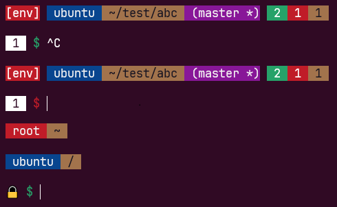

# My custom bash prompt

- Python3 env indicator
- Git branch indicator
  - Untracked files - Green
  - Deleted files - Red
  - Modified files - Orange
- Number of background jobs running if any - White
- Colored $ prompt, indicating success status of previous command
- Different bg color for root user
- User write access on PWD
